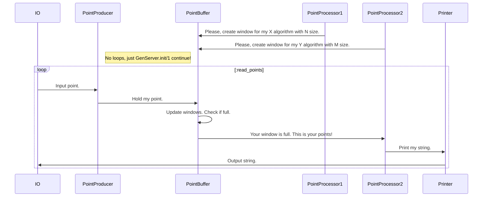

# Лабораторная работа №3

## Цель работы
Получить навыки работы с вводом/выводом, потоковой обработкой данных, командной строкой.

## Требования к разработанному ПО
- обязательно должна быть реализована линейная интерполяция (отрезками, [link](https://en.wikipedia.org/wiki/Linear_interpolation));
- настройки алгоритма аппроксимирования и выводимых данных должны задаваться через аргументы командной строки:
    - какие алгоритмы использовать (в том числе два сразу);
    - частота дискретизации результирующих данных;
    - и т.п.;
- входные данные должны задаваться в текстовом формате на подобии ".csv" (к примеру `x;y\n` или `x\ty\n`) и подаваться на стандартный ввод, входные данные должны быть отсортированы по возрастанию x;
- выходные данные должны подаваться на стандартный вывод;
- программа должна работать в потоковом режиме (пример -- `cat | grep 11`), это значит, что при запуске программы она должна ожидать получения данных на стандартный ввод, и, по мере получения достаточного количества данных, должна выводить рассчитанные точки в стандартный вывод;

Приложение должно быть организовано следующим образом:

```text
    +---------------------------+
    | обработка входного потока |
    +---------------------------+
            |
            | поток / список / последовательность точек
            v
    +------------------------+      +------------------------------+
    | алгоритм аппроксимации |<-----| генератор точек, для которых |
    +------------------------+      | необходимо вычислить         |
            |                       | аппроксимированное значение   |
            |                       +------------------------------+
            |
            | поток / список / последовательность рассчитанных точек
            v
    +------------------------+
    | печать выходных данных |
    +------------------------+
```

## Общие требования:
- программа должна быть реализована в функциональном стиле;
- ввод/вывод должен быть отделён от алгоритмов аппроксимации;
- требуется использовать идиоматичный для технологии стиль программирования.

## Общие рекомендации по реализации. 
Не стоит писать большие и страшные автоматы, управляющие поведением приложения в целом. Если у вас:

- Язык с ленью -- используйте лень.
- Языки с параллельным программированием и акторами -- используйте их.
- Язык без всей этой прелести -- используйте генераторы/итераторы/и т.п.

## Особенности реализации
### Сборка и запуск
- `mix escript.build`
- `./lab3 --window 3 --step 0.5`

Как работает:
```plain
1 1
1.9 3
Algorithm linear:
{1.0, 1.0}, {1.5, 2.111111111111111}
3 4
Algorithm linear:
{1.9, 3.0}, {2.4, 3.4545454545454546}, {2.9, 3.9090909090909096}
Algorithm lagrange:
{1.0, 1.0}, {1.5, 2.242424242424242}, {2.0, 3.1565656565656566}, {2.5, 3.7424242424242427}, {3.0, 4.0}
Algorithm gauss:
{1.0, 1.0}, {1.5, 2.234567901234568}, {2.0, 3.160493827160494}, {2.5, 3.777777777777778}, {3.0, 4.086419753086419}
```

Как падает:
```plain
1 1
1 1

05:44:57.561 [error] GenServer :linear terminating
** (ArithmeticError) bad argument in arithmetic expression
    (lab3 0.1.0) lib/lab3/interpolation/linear.ex:11: anonymous fn/5 in Lab3.Interpolation.Linear.interpolate/2
    (lab3 0.1.0) lib/lab3/interpolation/linear.ex:14: anonymous fn/2 in Lab3.Interpolation.Linear.interpolate/2
    (elixir 1.15.7) lib/stream.ex:613: anonymous fn/4 in Stream.map/2
    (elixir 1.15.7) lib/stream.ex:1759: Stream.do_unfold/4
    (elixir 1.15.7) lib/stream.ex:1828: Enumerable.Stream.do_each/4
    (elixir 1.15.7) lib/enum.ex:4387: Enum.reverse/1
    (elixir 1.15.7) lib/enum.ex:3702: Enum.to_list/1
    (lab3 0.1.0) lib/lab3/stage/point_processor.ex:31: Lab3.Stage.PointProcessor.handle_cast/2
Last message: {:"$gen_cast", [{1.0, 1.0}, {1.0, 1.0}]}
State: %Lab3.Stage.PointProcessor.State{step: 0.5, window: 2, algorithm: :linear, buffer: :buffer, consumer: :printer}
1 1

05:45:02.244 [error] GenServer :linear terminating
** (ArithmeticError) bad argument in arithmetic expression
    (lab3 0.1.0) lib/lab3/interpolation/linear.ex:11: anonymous fn/5 in Lab3.Interpolation.Linear.interpolate/2
    (lab3 0.1.0) lib/lab3/interpolation/linear.ex:14: anonymous fn/2 in Lab3.Interpolation.Linear.interpolate/2
    (elixir 1.15.7) lib/stream.ex:613: anonymous fn/4 in Stream.map/2
    (elixir 1.15.7) lib/stream.ex:1759: Stream.do_unfold/4
    (elixir 1.15.7) lib/stream.ex:1828: Enumerable.Stream.do_each/4
    (elixir 1.15.7) lib/enum.ex:4387: Enum.reverse/1
    (elixir 1.15.7) lib/enum.ex:3702: Enum.to_list/1
    (lab3 0.1.0) lib/lab3/stage/point_processor.ex:31: Lab3.Stage.PointProcessor.handle_cast/2
Last message: {:"$gen_cast", [{1.0, 1.0}, {1.0, 1.0}]}
State: %Lab3.Stage.PointProcessor.State{step: 0.5, window: 2, algorithm: :linear, buffer: :buffer, consumer: :printer}

05:45:02.248 [error] GenServer :lagrange terminating
** (ArithmeticError) bad argument in arithmetic expression
    (lab3 0.1.0) lib/lab3/interpolation/lagrange.ex:41: anonymous fn/3 in Lab3.Interpolation.Lagrange.polynomial/3
    (elixir 1.15.7) lib/enum.ex:1693: Enum."-map/2-lists^map/1-1-"/2
    (lab3 0.1.0) lib/lab3/interpolation/lagrange.ex:41: anonymous fn/5 in Lab3.Interpolation.Lagrange.polynomial/3
    (elixir 1.15.7) lib/enum.ex:1693: Enum."-map/2-lists^map/1-1-"/2
    (lab3 0.1.0) lib/lab3/interpolation/lagrange.ex:32: anonymous fn/2 in Lab3.Interpolation.Lagrange.polynomial_fun/1
    (lab3 0.1.0) lib/lab3/interpolation/lagrange.ex:16: anonymous fn/2 in Lab3.Interpolation.Lagrange.interpolate/2
    (elixir 1.15.7) lib/stream.ex:613: anonymous fn/4 in Stream.map/2
    (elixir 1.15.7) lib/stream.ex:1759: Stream.do_unfold/4
Last message: {:"$gen_cast", [{1.0, 1.0}, {1.0, 1.0}, {1.0, 1.0}]}
State: %Lab3.Stage.PointProcessor.State{step: 0.5, window: 3, algorithm: :lagrange, buffer: :buffer, consumer: :printer}

05:45:02.250 [error] GenServer :gauss terminating
** (ArithmeticError) bad argument in arithmetic expression
    (lab3 0.1.0) lib/lab3/interpolation/gauss.ex:34: Lab3.Interpolation.Gauss.gauss_polynomial/3
    (lab3 0.1.0) lib/lab3/interpolation/gauss.ex:18: anonymous fn/3 in Lab3.Interpolation.Gauss.interpolate/2
    (elixir 1.15.7) lib/stream.ex:613: anonymous fn/4 in Stream.map/2
    (elixir 1.15.7) lib/stream.ex:1759: Stream.do_unfold/4
    (elixir 1.15.7) lib/stream.ex:1828: Enumerable.Stream.do_each/4
    (elixir 1.15.7) lib/enum.ex:4387: Enum.reverse/1
    (elixir 1.15.7) lib/enum.ex:3702: Enum.to_list/1
    (lab3 0.1.0) lib/lab3/stage/point_processor.ex:31: Lab3.Stage.PointProcessor.handle_cast/2
Last message: {:"$gen_cast", [{1.0, 1.0}, {1.0, 1.0}, {1.0, 1.0}]}
State: %Lab3.Stage.PointProcessor.State{step: 0.5, window: 3, algorithm: :gauss, buffer: :buffer, consumer: :printer}
** (EXIT from #PID<0.100.0>) shutdown
```

### Обзор организации


### PointProducer
> No loops, just init continue

```elixir
  @impl true
  def init(state) do
    {:ok, state, {:continue, :read_points}}
  end

  # Produces 1 point at a time
  @impl true
  def handle_continue(:read_points, state) do
    case read_point() do
      nil -> GenServer.stop(state.name)
      point -> cast_point(point, state.buffer)
    end

    {:noreply, state, {:continue, :read_points}}
  end
```

### PointBuffer
- Идейно похож на [buffer](https://kotlinlang.org/api/kotlinx.coroutines/kotlinx-coroutines-core/kotlinx.coroutines.flow/buffer.html) в Kotlin Flow
- Сохраняет точку в окна для каждого алгоритма
- Если обработчик алгоритма умрёт, то после рестарта окно останется
- Owner окна = Обработчик алгоритма (ключ = алгоритм)

```elixir
  @impl true
  def init(state) do
    {:ok, state}
  end

  @impl true
  def handle_cast({:add_window, algorithm: algorithm, size: size}, %__MODULE__{windows: windows}) do
    # New window is not created for same algorithm (in case of restart or multiple workers)
    # So worker will keep falling...
    {:noreply, Map.put_new(windows, algorithm, Window.new(size)) |> new()}
  end

  def handle_cast({:add_point, point}, %__MODULE__{windows: windows}) do
    state =
      windows
      |> add_point(point)
      |> cast_full()
      |> new()

    {:noreply, state}
  end
```

### PointProcessor
- Шаблон для выполнения конкретного алгоритма
- Задаётся буффер, алгоритм и размер окна
- При инициализации отправляет запрос буфферу, чтобы тот создал окно

```elixir
  @impl true
  def init(state) do
    GenServer.cast(state.buffer, {:add_window, algorithm: state.algorithm, size: state.window})

    {:ok, state}
  end

  @impl true
  def handle_cast(points, state) when length(points) == state.window do
    result =
      handle_algorithm(state.algorithm, points, state.step)
      |> to_string(state.algorithm)

    GenServer.cast(state.consumer, result)

    {:noreply, state}
  end

  def handle_algorithm(:gauss, points, step), do: Gauss.interpolate(points, step)

  def handle_algorithm(:linear, points, step), do: Linear.interpolate(points, step)

  def handle_algorithm(:lagrange, points, step), do: Lagrange.interpolate(points, step)
```

### Config
```elixir
defmodule Lab3.Config do
  @moduledoc """
  Struct to store config.
  """

  @enforce_keys [:step]
  defstruct [:step, window: 5, separator: " "]

  def new(args) do
    case OptionParser.parse(args, strict: [window: :integer, step: :float]) do
      {[window: window, step: step], _, _} -> %__MODULE__{window: window, step: step}
      {[step: step], _, _} -> %__MODULE__{step: step}
      _ -> raise "--step <value> is missing"
    end
  end
end
```

### Костыли
- Когда у есть `Application`, становится больно. Приходится удалять ссылку на модуль в `MixProject` (`mod: {Lab3.Application, []}`), потому что `[]` - это аргументы
```elixir
def application do
    [
      extra_applications: [:logger]
    ]
  end
```

- https://medium.com/blackode/writing-the-command-line-application-in-elixir-78a8d1b1850

### FloatStream
No float range in Elixir :( (and Erlang)
\- https://stackoverflow.com/questions/34383303/range-of-floating-point-numbers

```elixir
defmodule Lab3.Util.FloatStream do
  @spec new(from :: float(), to :: float(), step :: float()) :: Enumerable.t(float())
  def new(from, to, step) do
    from
    |> Stream.iterate(&(&1 + step))
    |> Stream.take_while(&(&1 <= to))
  end
end
```

### Window
```elixir
defmodule Lab3.Util.Window do
  @moduledoc """
  Struct to operate with fixed size list.
  """

  @enforce_keys [:size]
  defstruct [:size, elements: []]

  @type t :: %__MODULE__{}

  @spec new(size :: pos_integer()) :: t()
  def new(size) do
    %__MODULE__{size: size}
  end

  def push(%__MODULE__{size: size, elements: []}, element) do
    %__MODULE__{size: size, elements: [element]}
  end

  def push(%__MODULE__{size: size, elements: elements}, element) when length(elements) < size do
    %__MODULE__{size: size, elements: elements ++ [element]}
  end

  def push(%__MODULE__{size: size, elements: [_ | tail]}, element) do
    %__MODULE__{size: size, elements: tail ++ [element]}
  end

  def full?(%__MODULE__{size: size, elements: elements}), do: length(elements) == size
end
```

## Архив идей
### GenStage
>  GenStage provides a way for us to define a pipeline of work to be carried out by independent steps (or stages) in separate processes.
\- https://elixirschool.com/en/lessons/data_processing/genstage

- входит в стандартную экосистему языка

#### Роли 
- `producer`: обработка входного потока
- `producer_consumer`: выполнение алгоритмов аппроксимации
- `consumer`: печать выходных данных

`[producer] -> [producer_consumer] -> [consumer]`

В доках советуют рассмотреть `ConsumerSupervision`, применимо к данной лабораторной работе он мог бы спавнить процессы с выполнением конкретного алгоритма аппроксимации.
Но в таком случае, чтобы быть полноценным `consumer` ему нужно печать текст, а мы ходим делать это в отдельном "stage". 
Если же спавнить их с ролью `producer_consumer`, то сильно усложняется всё взаимодействие

Может быть, стоит сделать отправку событий по алгоритмам аппроксимации с дублирующим блоком данных, то есть `1 алгоритм` = `1 consumer`
> GenStage.PartitionDispatcher - dispatches all events to a fixed amount of consumers that works as partitions according to a hash function.

Ещё можно сделать весёлый `Broadcast` с пробросом событий.

- https://medium.com/@andreichernykh/elixir-a-few-things-about-genstage-id-wish-to-knew-some-time-ago-b826ca7d48ba

#### Тоже самое, но иначе
- Голые процессы - https://elixirschool.com/en/lessons/intermediate/concurrency#processes-0
- Flow как в Kotlin - https://github.com/dashbitco/flow
- Hype solution - https://elixir-broadway.org/

#### ProducerConsumer State
```elixir

defmodule Lab3.Stage.ProducerConsumer.State do
  @moduledoc """
  Struct to store state.
  """

  alias Lab3.Util.Window

  @enforce_keys [:step, :methods]
  defstruct [:step, :methods]

  def new(step, window),
    do: %__MODULE__{
      step: step,
      methods: %{
        lagrange: Window.new(window),
        linear: Window.new(2)
      }
    }

  def add_point(
        %__MODULE__{
          step: step,
          methods: methods
        },
        point
      ),
      do: %__MODULE__{
        step: step,
        methods:
          Enum.map(methods, fn {method, window} -> {method, Window.push(window, point)} end)
      }
end
```

### Broadway
- https://hexdocs.pm/broadway/architecture.html

Понятные абстрации: `stage` и `pipeline`.

### KIF
Everyone knows KISS.

Today I'd like to introduce KIF: Keep It Falling.

Principle: `Once something falls, it should continue falling.`

Example:
- ArithmeticError is raised in gauss algorithm worker
- It gets restarted
- ArithmeticError is raised again since the points have the same invalid condition
- It gets restarted again...

## Вывод
В ходе работы познакомился с `GenServer` и `GenStage`, узнал о недостатках экосистемы языка.