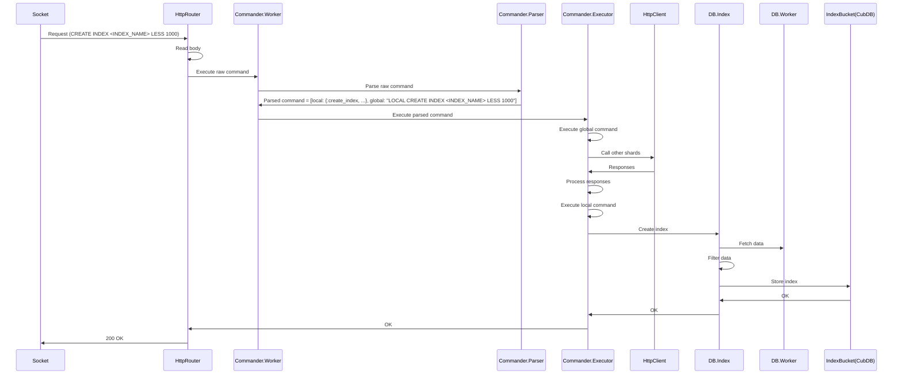
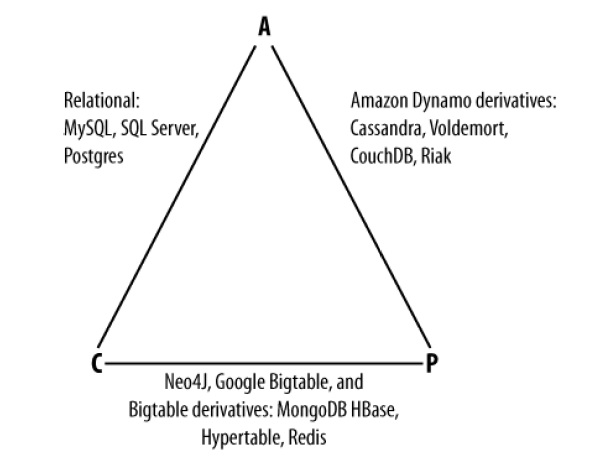

# Лабораторная работа №3

## Цель работы
Получить навыки работы со специфичными для выбранной технологии/языка программирования приёмами.

## Требования к разработанному ПО
- Поддержка различных типов данных (int, string, list)
- Возможность создания распределенных индексов
- Возможность шардирования и репликации

## Особенности реализации
### Конфигурация шардирования в отдельном TOML файле
```toml
[[shards]]
name = "Saint-Petersburg"
shard_key = 0
address = "localhost:8080"
replicas = ["localhost:8084"]

[[shards]]
name = "Moscow"
shard_key = 1
address = "localhost:8081"
```

### Сборка и запуск
```shell
mix escript.build

./lab4 --port 8080 --sharding-file conf/sharding.toml --shard Saint-Petersburg --data-dir db/spb &
./lab4 --port 8084 --sharding-file conf/sharding.toml --shard Saint-Petersburg --replica --data-dir db/spb-replica &
./lab4 --port 8081 --sharding-file conf/sharding.toml --shard Moscow --data-dir db/moscow &
```

Есть примеры в папке `scripts`.

### Обзор системы на примере создания индекса


### CAP
Simplicity is reliability (c) [Yuriy Nasretdinov][Yuriy Nasretdinov] [(SovietReliable)][SovietReliable]



`Redis` is CP system, so I don't care about availability of my system...

### Статическое шардирование
- `SHARD("KEY") = HASH("KEY") % NUM_OF_SHARDS`

### HTTP server
- Every node in cluster is equal.
- So any node can redirect to correct shard

Trust me, `Plug` is trash.

Если ключ не относится к ноде(шарду или реплике), она обращается к нужной и кидает ответ с указанием location.

### Локальное хранилище
- `HashMap` это скучно
- Кэши тоже
- Делать свой файловый `B+ tree` долго
- Хочется что-то типо `boltdb`, но идиоматичное для Elixir: [CubDB](https://github.com/lucaong/cubdb)

**CubDB** - локальное KV хранилище, которое умеет записывать всё в файл.

### Если избегать JSON, то рано или поздно это выстрелит
```
01:38:23.454 [debug]  Replica updated resp: {:error, %Mint.HTTPError{reason: {:invalid_request_target, "/replica-updated/key-22002/䲱䗩"}, module: Mint.HTTP1}}
01:38:24.455 [debug] shard=0  Next replica update [{"key-22002", [19633, 17897]}]
```

### Парсер команд
Взял за основу [NimbleParsec](https://hexdocs.pm/nimble_parsec/1.4.0/NimbleParsec.html#content)

Пример:
```elixir
set =
    ignore(string("SET"))
    |> tag(:local)
    |> ignore(some_space)
    |> concat(key)
    |> ignore(some_space)
    |> concat(list_or_value)
    |> optional(ignore(some_space))
    |> tag(:set)
```

## Пример работы
### Запросы
```
curl "http://localhost:8080" -d "GET key-key"
echo
curl "http://localhost:8080" -d "DELETE key-key"
echo
curl "http://localhost:8080" -d "DELETE key-22004 key-2024"
echo
curl "http://localhost:8080" -d "SET  key-22004   [$RANDOM]  "
echo
curl "http://localhost:8081" -d "GET     key-22004"
echo
curl "http://localhost:8080" -d "SET key-22001 [$RANDOM]"
echo
curl "http://localhost:8080" -d "LLEN key-22001"
echo
curl "http://localhost:8080" -d "SET key-22002 [value-$RANDOM]"
echo
curl "http://localhost:8080" -d "SET key-22002 [$RANDOM       ,            $RANDOM]"
echo
echo "LIST OPERATIONS"
curl "http://localhost:8080" -d "LLEN key-22002"
echo
curl "http://localhost:8080" -d "GET key-22002"
echo
curl "http://localhost:8080" -d "LTRIM key-22002 0 1"
echo
curl "http://localhost:8080" -d "GET key-22002"
echo
curl "http://localhost:8080" -d "LTRIM key-22002 0"
echo
curl "http://localhost:8080" -d "GET key-22002"
echo
curl "http://localhost:8080" -d "LPUSH key-22002 $RANDOM"
echo
curl "http://localhost:8080" -d "GET key-22002"
echo
curl "http://localhost:8080" -d "LPOP key-22002"
echo
curl "http://localhost:8080" -d "GET key-22002"
echo
curl "http://localhost:8080" -d "RPUSH key-22002 $RANDOM"
echo
curl "http://localhost:8080" -d "GET key-22002"
echo
curl "http://localhost:8080" -d "RPOP key-22002"
echo
curl "http://localhost:8080" -d "GET key-22002"
echo
echo "LMOVE"
curl "http://localhost:8080" -d "LMOVE key-22002 key-key LEFT RIGHT"
echo
curl "http://localhost:8080" -d "GET key-22002"
echo
curl "http://localhost:8080" -d "GET key-key"
echo
curl "http://localhost:8080" -d "LMOVE key-key key-22002 RIGHT LEFT"
echo
curl "http://localhost:8080" -d "LMOVE key-key key-22002 RIGHT RIGHT"
echo
curl "http://localhost:8080" -d "GET key-22002"
echo
curl "http://localhost:8080" -d "GET key-key"
echo
curl "http://localhost:8080" -d "LLEN key-22003"
echo
curl "http://localhost:8080" -d "DELETE INDEX dima5"
echo
curl "http://localhost:8080" -d "CREATE INDEX dima5 LESS 100000"
echo
curl "http://localhost:8080" -d "SET key-22001 $RANDOM"
echo
curl "http://localhost:8080" -d "SET key-22003 $RANDOM"
echo
curl "http://localhost:8080" -d "FETCH INDEX dima5"
echo
curl "http://localhost:8080" -d "DELETE key-22001"
echo
curl "http://localhost:8080" -d "GET key-22001"
echo
curl "http://localhost:8080" -d "SET key-22003 $RANDOM"
echo
curl "http://localhost:8080" -d "GET key-22003"
echo
curl "http://localhost:8080" -d "FETCH INDEX dima5"
echo
```

### Ответы
```
Not found
OK
Keyset contains other shard keys
OK
[20349]
OK
1
OK
OK
LIST OPERATIONS
2
[12777,27055]
OK
[12777]
OK
[12777]
OK
[656,12777]
OK
[12777]
OK
[12777,29482]
OK
[12777]
LMOVE
OK
[]
[12777]
OK
Empty list
[12777]
[]
Not a list
OK
OK
OK
OK
[{"key-22003":15802},{"key-22001":26860}]
OK
Not found
OK
31805
[{"key-22003":31805}]
```

### Вывод
```
20:51:03.898 [info] shard=0  Parsed shards
20:51:03.916 [info] shard=1  Parsed shards
20:51:03.934 [debug]  %Lab4.Config.ShardsInfo{list: [%{name: "Saint-Petersburg", address: "localhost:8080", shard_key: 0, replicas: ["localhost:8084"]}, %{name: "Moscow", address: "localhost:8081", shard_key: 1}], count: 2, current: %{name: "Saint-Petersburg", address: "localhost:8080", shard_key: 0, replicas: ["localhost:8084"]}}
20:51:03.934 [info] shard=0  Hello! My name is Saint-Petersburg
20:51:03.937 [info] shard=0  Parsed shards
20:51:03.953 [debug]  %Lab4.Config.ShardsInfo{list: [%{name: "Saint-Petersburg", address: "localhost:8080", shard_key: 0, replicas: ["localhost:8084"]}, %{name: "Moscow", address: "localhost:8081", shard_key: 1}], count: 2, current: %{name: "Moscow", address: "localhost:8081", shard_key: 1}}
20:51:03.953 [info] shard=1  Hello! My name is Moscow
20:51:03.983 [debug]  %Lab4.Config.ShardsInfo{list: [%{name: "Saint-Petersburg", address: "localhost:8080", shard_key: 0, replicas: ["localhost:8084"]}, %{name: "Moscow", address: "localhost:8081", shard_key: 1}], count: 2, current: %{name: "Saint-Petersburg", address: "localhost:8080", shard_key: 0, replicas: ["localhost:8084"]}}
20:51:03.983 [info] shard=0  Replica starting
20:51:04.064 [debug] shard=0  Indices: dima5
20:51:04.065 [debug] shard=1  Indices: dima5
20:51:04.136 [debug] shard=0  Next replica update {"key-22003", 28150}
20:51:04.149 [info] worker=replica-0  Got update
20:51:04.158 [debug]  Replica updated
20:51:04.158 [info] worker=db_worker-0  Deleting replicated key key-22003 from replica bucket
20:51:05.162 [debug] worker=replica-0  Shard has no updates
20:51:06.163 [debug] worker=replica-0  Shard has no updates
20:51:07.164 [debug] worker=replica-0  Shard has no updates
20:51:08.165 [debug] worker=replica-0  Shard has no updates
20:51:09.166 [debug] worker=replica-0  Shard has no updates
20:51:10.167 [debug] worker=replica-0  Shard has no updates
20:51:11.168 [debug] worker=replica-0  Shard has no updates
20:51:12.169 [debug] worker=replica-0  Shard has no updates
20:51:12.225 [info] shard=0  GET key-key
20:51:12.235 [debug] worker=commander-0  Parsed command: {:get, ["key-key"]}
20:51:12.243 [info] shard=0  DELETE key-key
20:51:12.244 [debug] worker=commander-0  Parsed command: {:delete_keys, ["key-key"]}
20:51:12.244 [debug]  Handling deleted keys ["key-key"]
20:51:12.244 [debug]  Unchanged: [{"key-22003", 28150}]
20:51:12.248 [info] shard=0  DELETE key-22004 key-2024
20:51:12.249 [debug] worker=commander-0  Parsed command: {:delete_keys, ["key-22004", "key-2024"]}
20:51:12.254 [info] shard=0  SET  key-22004   [20349]  
20:51:12.254 [debug] worker=commander-0  Parsed command: {:set, ["key-22004", [20349]]}
20:51:12.254 [debug] shard=0  Redirected to 1
20:51:12.301 [info] shard=1  SET  key-22004   [20349]  
20:51:12.310 [debug] worker=commander-1  Parsed command: {:set, ["key-22004", [20349]]}
20:51:12.311 [debug] worker=db_worker-1  SET value: [20349]
20:51:12.316 [debug]  {:less, 100000} {"key-22004", [20349]}
20:51:12.318 [debug]  Not integer 佽
20:51:12.318 [debug] shard=1  Skipped index dima5 for update
20:51:12.327 [info] shard=1  GET     key-22004
20:51:12.327 [debug] worker=commander-1  Parsed command: {:get, ["key-22004"]}
20:51:12.336 [info] shard=0  SET key-22001 [28265]
20:51:12.336 [debug] worker=commander-0  Parsed command: {:set, ["key-22001", [28265]]}
20:51:12.336 [debug] shard=0  Redirected to 1
20:51:12.336 [info] shard=1  SET key-22001 [28265]
20:51:12.336 [debug] worker=commander-1  Parsed command: {:set, ["key-22001", [28265]]}
20:51:12.336 [debug] worker=db_worker-1  SET value: [28265]
20:51:12.339 [debug]  {:less, 100000} {"key-22001", [28265]}
20:51:12.339 [debug]  Not integer 湩
20:51:12.339 [debug] shard=1  Skipped index dima5 for update
20:51:12.344 [info] shard=0  LLEN key-22001
20:51:12.344 [debug] worker=commander-0  Parsed command: {:llen, ["key-22001"]}
20:51:12.344 [debug] shard=0  Redirected to 1
20:51:12.345 [info] shard=1  LLEN key-22001
20:51:12.345 [debug] worker=commander-1  Parsed command: {:llen, ["key-22001"]}
20:51:12.350 [info] shard=0  SET key-22002 [value-23376]
20:51:12.350 [debug] worker=commander-0  Parsed command: {:set, ["key-22002", ["value-23376"]]}
20:51:12.350 [debug] worker=db_worker-0  SET value: ["value-23376"]
20:51:12.352 [debug]  {:less, 100000} {"key-22002", ["value-23376"]}
20:51:12.355 [debug]  Not integer value-23376
20:51:12.355 [debug] shard=0  Skipped index dima5 for update
20:51:12.360 [info] shard=0  SET key-22002 [12777       ,            27055]
20:51:12.360 [debug] worker=commander-0  Parsed command: {:set, ["key-22002", [12777, 27055]]}
20:51:12.360 [debug] worker=db_worker-0  SET value: [12777, 27055]
20:51:12.362 [debug]  {:less, 100000} {"key-22002", [12777, 27055]}
20:51:12.362 [debug]  Not integer ㇩榯
20:51:12.362 [debug] shard=0  Skipped index dima5 for update
20:51:12.368 [info] shard=0  LLEN key-22002
20:51:12.368 [debug] worker=commander-0  Parsed command: {:llen, ["key-22002"]}
20:51:12.374 [info] shard=0  GET key-22002
20:51:12.374 [debug] worker=commander-0  Parsed command: {:get, ["key-22002"]}
20:51:12.379 [info] shard=0  LTRIM key-22002 0 1
20:51:12.379 [debug] worker=commander-0  Parsed command: {:ltrim, ["key-22002", 0, 1]}
20:51:12.379 [debug] worker=db_worker-0  SET value: [12777]
20:51:12.387 [info] shard=0  GET key-22002
20:51:12.387 [debug] worker=commander-0  Parsed command: {:get, ["key-22002"]}
20:51:12.393 [info] shard=0  LTRIM key-22002 0
20:51:12.393 [debug] worker=commander-0  Parsed command: {:ltrim, ["key-22002", 0]}
20:51:12.393 [debug] worker=db_worker-0  SET value: [12777]
20:51:12.401 [info] shard=0  GET key-22002
20:51:12.402 [debug] worker=commander-0  Parsed command: {:get, ["key-22002"]}
20:51:12.407 [info] shard=0  LPUSH key-22002 656
20:51:12.407 [debug] worker=commander-0  Parsed command: {:lpush, ["key-22002", 656]}
20:51:12.407 [debug] worker=db_worker-0  SET value: [656, 12777]
20:51:12.414 [info] shard=0  GET key-22002
20:51:12.414 [debug] worker=commander-0  Parsed command: {:get, ["key-22002"]}
20:51:12.420 [info] shard=0  LPOP key-22002
20:51:12.420 [debug] worker=commander-0  Parsed command: {:lpop, ["key-22002"]}
20:51:12.420 [debug] worker=db_worker-0  SET value: [12777]
20:51:12.427 [info] shard=0  GET key-22002
20:51:12.427 [debug] worker=commander-0  Parsed command: {:get, ["key-22002"]}
20:51:12.432 [info] shard=0  RPUSH key-22002 29482
20:51:12.432 [debug] worker=commander-0  Parsed command: {:rpush, ["key-22002", 29482]}
20:51:12.432 [debug] worker=db_worker-0  SET value: [12777, 29482]
20:51:12.440 [info] shard=0  GET key-22002
20:51:12.440 [debug] worker=commander-0  Parsed command: {:get, ["key-22002"]}
20:51:12.445 [info] shard=0  RPOP key-22002
20:51:12.445 [debug] worker=commander-0  Parsed command: {:rpop, ["key-22002"]}
20:51:12.445 [debug] worker=db_worker-0  SET value: [12777]
20:51:12.453 [info] shard=0  GET key-22002
20:51:12.453 [debug] worker=commander-0  Parsed command: {:get, ["key-22002"]}
20:51:12.458 [info] shard=0  LMOVE key-22002 key-key LEFT RIGHT
20:51:12.458 [debug] worker=commander-0  Parsed command: {:lmove, ["key-22002", "key-key", :left, :right]}
20:51:12.458 [debug] worker=db_worker-0  SET value: []
20:51:12.460 [debug] worker=db_worker-0  SET value: [12777]
20:51:12.468 [info] shard=0  GET key-22002
20:51:12.468 [debug] worker=commander-0  Parsed command: {:get, ["key-22002"]}
20:51:12.473 [info] shard=0  GET key-key
20:51:12.473 [debug] worker=commander-0  Parsed command: {:get, ["key-key"]}
20:51:12.478 [info] shard=0  LMOVE key-key key-22002 RIGHT LEFT
20:51:12.479 [debug] worker=commander-0  Parsed command: {:lmove, ["key-key", "key-22002", :right, :left]}
20:51:12.479 [debug] worker=db_worker-0  SET value: []
20:51:12.481 [debug] worker=db_worker-0  SET value: [12777]
20:51:12.488 [info] shard=0  LMOVE key-key key-22002 RIGHT RIGHT
20:51:12.488 [debug] worker=commander-0  Parsed command: {:lmove, ["key-key", "key-22002", :right, :right]}
20:51:12.493 [info] shard=0  GET key-22002
20:51:12.493 [debug] worker=commander-0  Parsed command: {:get, ["key-22002"]}
20:51:12.498 [info] shard=0  GET key-key
20:51:12.498 [debug] worker=commander-0  Parsed command: {:get, ["key-key"]}
20:51:12.503 [info] shard=0  LLEN key-22003
20:51:12.503 [debug] worker=commander-0  Parsed command: {:llen, ["key-22003"]}
20:51:12.509 [info] shard=0  DELETE INDEX dima5
20:51:12.509 [debug] worker=commander-0  Parsed command: [local: {:delete_index, [index_name: "dima5"]}, global: "LOCAL DELETE INDEX dima5", type: :ok]
20:51:12.509 [debug] shard=0  Executing global LOCAL DELETE INDEX dima5
20:51:12.509 [info] shard=1  LOCAL DELETE INDEX dima5
20:51:12.509 [debug] worker=commander-1  Parsed command: {:delete_index, [index_name: "dima5"]}
20:51:12.517 [info] shard=0  CREATE INDEX dima5 LESS 100000
20:51:12.517 [debug] worker=commander-0  Parsed command: [local: {:create_index, [index_name: "dima5", less: 100000]}, global: "LOCAL CREATE INDEX dima5 LESS 100000", type: :ok]
20:51:12.517 [debug] shard=0  Executing global LOCAL CREATE INDEX dima5 LESS 100000
20:51:12.517 [info] shard=1  LOCAL CREATE INDEX dima5 LESS 100000
20:51:12.517 [debug] worker=commander-1  Parsed command: {:create_index, [index_name: "dima5", less: 100000]}
20:51:12.517 [debug]  Not integer 湩
20:51:12.517 [debug]  Not integer 佽
20:51:12.518 [debug] shard=1  New index dima5 created: {:less, 100000}, []
20:51:12.519 [debug]  Not integer ㇩
20:51:12.519 [debug]  Not integer 
20:51:12.520 [debug] shard=0  New index dima5 created: {:less, 100000}, [{"key-22003", 28150}]
20:51:12.526 [info] shard=0  SET key-22001 26860
20:51:12.526 [debug] worker=commander-0  Parsed command: {:set, ["key-22001", 26860]}
20:51:12.526 [debug] shard=0  Redirected to 1
20:51:12.526 [info] shard=1  SET key-22001 26860
20:51:12.526 [debug] worker=commander-1  Parsed command: {:set, ["key-22001", 26860]}
20:51:12.526 [debug] worker=db_worker-1  SET value: 26860
20:51:12.529 [debug]  {:less, 100000} {"key-22001", 26860}
20:51:12.529 [debug] shard=1  Index dima5 update: {"key-22001", 26860}
20:51:12.535 [info] shard=0  SET key-22003 15802
20:51:12.536 [debug] worker=commander-0  Parsed command: {:set, ["key-22003", 15802]}
20:51:12.536 [debug] worker=db_worker-0  SET value: 15802
20:51:12.540 [debug]  {:less, 100000} {"key-22003", 15802}
20:51:12.540 [debug] shard=0  Index dima5 update: {"key-22003", 15802}
20:51:12.548 [info] shard=0  FETCH INDEX dima5
20:51:12.548 [debug] worker=commander-0  Parsed command: [local: {:fetch_index, [index_name: "dima5"]}, global: "LOCAL FETCH INDEX dima5", type: :concat]
20:51:12.548 [debug] shard=0  Executing global LOCAL FETCH INDEX dima5
20:51:12.548 [info] shard=1  LOCAL FETCH INDEX dima5
20:51:12.548 [debug] worker=commander-1  Parsed command: {:fetch_index, [index_name: "dima5"]}
20:51:12.556 [info] shard=0  DELETE key-22001
20:51:12.556 [debug] worker=commander-0  Parsed command: {:delete_keys, ["key-22001"]}
20:51:12.556 [debug] shard=0  Redirected to 1
20:51:12.556 [info] shard=1  DELETE key-22001
20:51:12.556 [debug] worker=commander-1  Parsed command: {:delete_keys, ["key-22001"]}
20:51:12.558 [debug]  Handling deleted keys ["key-22001"]
20:51:12.559 [debug]  New data: []
20:51:12.584 [info] shard=0  GET key-22001
20:51:12.584 [debug] worker=commander-0  Parsed command: {:get, ["key-22001"]}
20:51:12.585 [info] shard=1  GET key-22001
20:51:12.585 [debug] worker=commander-1  Parsed command: {:get, ["key-22001"]}
20:51:12.584 [debug] shard=0  Redirected to 1
20:51:12.600 [info] shard=0  SET key-22003 31805
20:51:12.600 [debug] worker=commander-0  Parsed command: {:set, ["key-22003", 31805]}
20:51:12.601 [debug] worker=db_worker-0  SET value: 31805
20:51:12.605 [debug]  {:less, 100000} {"key-22003", 31805}
20:51:12.605 [debug] shard=0  Index dima5 update: {"key-22003", 31805}
20:51:12.619 [info] shard=0  GET key-22003
20:51:12.619 [debug] worker=commander-0  Parsed command: {:get, ["key-22003"]}
20:51:12.629 [info] shard=0  FETCH INDEX dima5
20:51:12.629 [debug] worker=commander-0  Parsed command: [local: {:fetch_index, [index_name: "dima5"]}, global: "LOCAL FETCH INDEX dima5", type: :concat]
20:51:12.629 [debug] shard=0  Executing global LOCAL FETCH INDEX dima5
20:51:12.629 [info] shard=1  LOCAL FETCH INDEX dima5
20:51:12.630 [debug] worker=commander-1  Parsed command: {:fetch_index, [index_name: "dima5"]}
20:51:13.170 [debug] shard=0  Next replica update {"key-22002", [12777]}
20:51:13.171 [info] worker=replica-0  Got update
20:51:13.174 [debug]  Replica updated
20:51:13.175 [info] worker=db_worker-0  Deleting replicated key key-22002 from replica bucket
20:51:14.178 [debug] shard=0  Next replica update {"key-22003", 31805}
20:51:14.178 [info] worker=replica-0  Got update
20:51:14.184 [debug]  Replica updated
20:51:14.184 [info] worker=db_worker-0  Deleting replicated key key-22003 from replica bucket
20:51:15.186 [debug] shard=0  Next replica update {"key-key", []}
20:51:15.187 [info] worker=replica-0  Got update
20:51:15.190 [debug]  Replica updated
20:51:15.191 [info] worker=db_worker-0  Deleting replicated key key-key from replica bucket
20:51:16.192 [debug] worker=replica-0  Shard has no updates
20:51:17.194 [debug] worker=replica-0  Shard has no updates
```

## Вывод
Мне понравилось писать красивый парсер и стараться избегать json.

## Worth to mention
- [Yuriy Nasretdinov][Yuriy Nasretdinov]
- [His 'distribkv' in Go playlist](https://www.youtube.com/playlist?list=PLWwSgbaBp9XrMkjEhmTIC37WX2JfwZp7I)
- [Crafting a Database Engine: how DBs do what they do by Luca Ongaro (CubDB) | Ruby User Group Berlin](https://www.youtube.com/watch?v=fSgoeKJ06B4)
- [Всё, что вы не знали о CAP теореме | Хабр](https://habr.com/ru/articles/328792/)
- https://serokell.io/blog/parser-combinators-in-elixir

[Yuriy Nasretdinov]: https://github.com/YuriyNasretdinov
[SovietReliable]: https://www.youtube.com/@SovietReliable

